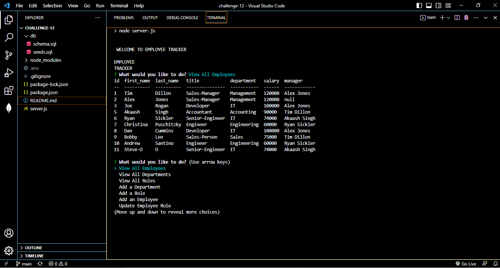

# Employee Tracker

## Description

A command line application content management system used to manage a companies employee database.

- The motivation to build to application was to have a way to track and add employees.
- I built this application to better organize the information about employess at my business.
- This application solves the problem of budgeting salaries easily and adding and deleting employees.
- Through the process of building this program I learned about databases and mysql.

## Installation

open an integrated terminal, run "npm i mysql2", "npm i inquirer", "npm i console.table"

## Usage

Walk Through Video Link:https://drive.google.com/file/d/1Ca5UHoB9xTRTxWEc4QVitDPVYPbIxY5j/view

In the terminal, run, "npm i", "mysql -u root -p" "SOURCE db/schema.sql", "SOURCE db/seeds.sql", "npm start"

